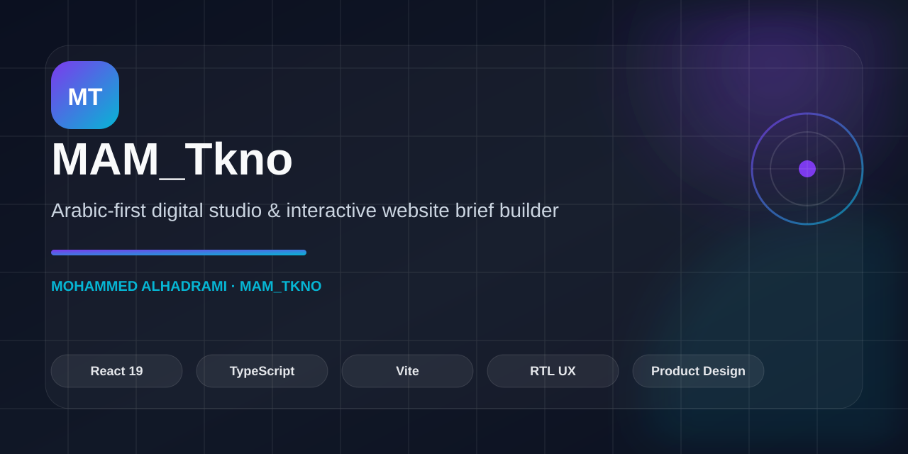
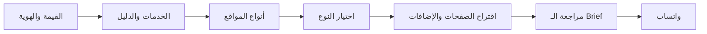

# MAM_Tkno — استوديو رقمي وباني Brief للمواقع




**Arabic-first portfolio + interactive website-scope builder.**

[Project Charter](docs/PROJECT-CHARTER.md) · [Requirements](docs/PRODUCT-REQUIREMENTS.md) · [Architecture](docs/TECHNICAL-ARCHITECTURE.md) · [Website Types](client/src/lib/website-types.ts)

## التعريف المختصر

**MAM_Tkno** استوديو رقمي مستقل باللغة العربية وواجهة RTL، يجمع بين عرض أعمال محمد الحضرمي/أبو السرور في تصميم وتطوير الواجهات وثيمات متاجر سلة، وبين أداة تفاعلية تساعد العميل على تحديد نوع الموقع ونطاقه قبل طلب دراسة وتكلفة.

الموقع ليس نموذج تسعير آليًا ولا متجر خدمات. وظيفته الأساسية هي:

1. بناء الثقة عبر المشاريع الحقيقية ودراسات الحالة.
2. شرح مجالات العمل وخدمات التصميم والتطوير بطريقة عملية.
3. مساعدة العميل على اختيار أحد أنواع المواقع الستة.
4. إنشاء brief أولي مخصص، مع اقتراح الصفحات والإضافات المناسبة تلقائيًا.
5. تسليم brief مفصل إلى واتساب لمراجعته وإعداد دراسة نطاق وعرض سعر لاحقًا.

## Portfolio Proof

| البعد | الدليل |
|---|---|
| **المشكلة** | طلبات المواقع تبدأ غالبًا بنطاق غير واضح وصفحات وإضافات غير محددة. |
| **الحل** | بورتفوليو عربي RTL مع أداة تفاعلية تحوّل احتياج العميل إلى Brief أولي منظم قبل التواصل. |
| **تنفيذ المنتج** | [تعريف المشروع](docs/PROJECT-CHARTER.md) · [المتطلبات](docs/PRODUCT-REQUIREMENTS.md) · [المعمارية](docs/TECHNICAL-ARCHITECTURE.md) |
| **منطق التوصيات** | [website-types.ts](client/src/lib/website-types.ts) · [portfolio-data.ts](client/src/lib/portfolio-data.ts) |
| **الحالة الحالية** | React/Vite ثابت مع تسليم الـBrief إلى واتساب؛ لا يدّعي وجود Backend أو تسعير آلي. |

## المسار الأساسي للزائر



## أنواع المواقع المدعومة

- مواقع الشركات والخدمات.
- المتاجر الإلكترونية.
- صفحات الهبوط والحملات.
- مواقع الأعمال والملفات الشخصية.
- مواقع الحجز والخدمات.
- تطبيقات الويب ولوحات التحكم.

## حدود المنتج الحالية

- الواجهة ثابتة React/Vite ولا يوجد backend مخصص.
- بيانات الأنواع والتوصيات موجودة في `client/src/lib/website-types.ts`.
- بيانات brief تعيش داخل حالة React أثناء الجلسة الحالية، وليست قاعدة بيانات.
- الإرسال النهائي يفتح رسالة واتساب جاهزة؛ لا يتم الإرسال أو التسعير تلقائيًا من الموقع.
- خيارات الدفع والمصادقة والإشعارات والمحادثة تظهر كعناصر نطاق يمكن مناقشتها، وليست تكاملات منفذة داخل هذا الموقع.

## خريطة المرجع

| الملف | دوره |
|---|---|
| `docs/PROJECT-CHARTER.md` | تعريف المشروع، المشكلة، الجمهور، والقيمة |
| `docs/PROJECT-DATA.md` | مصدر الحقيقة للمحتوى والأنواع والمشاريع والاتصالات |
| `docs/PRODUCT-REQUIREMENTS.md` | المتطلبات الوظيفية وغير الوظيفية ومعايير القبول |
| `docs/UX-CONTENT-MODEL.md` | رحلة المستخدم، بنية المحتوى، والاقتراحات |
| `docs/TECHNICAL-ARCHITECTURE.md` | العمارة، البيانات، الحالات، والحدود التقنية |
| `docs/DEVELOPMENT-ROADMAP.md` | مراحل التطوير والأولويات ومخاطر التنفيذ |
| `docs/diagrams/*.mmd` | مخططات Mermaid قابلة للتعديل |
| `SPEC-MAM_Tkno.md` | المواصفة التنفيذية المرتبطة بالكود |
| `project_research.md` | سجل البحث السابق عن المشاريع والروابط العامة |
| `tasks/plan.md` | الشرائح التنفيذية الحالية |
| `tasks/todo.md` | قائمة التحقق التنفيذية |

## أوامر العمل

```bash
pnpm run dev
pnpm run check
pnpm run build
pnpm run verify:seo
pnpm run test:visual
```

## قاعدة التحديث

عند تغيير فكرة المنتج أو تدفق brief أو بيانات المشاريع:

1. حدّث ملفات `docs/` و`SPEC-MAM_Tkno.md` أولًا.
2. حدّث مصدر البيانات أو المكوّن المتأثر.
3. حدّث الاختبارات ومعايير القبول.
4. شغّل الفحوص الأربعة واحفظ checkpoint بعد نجاحها.
